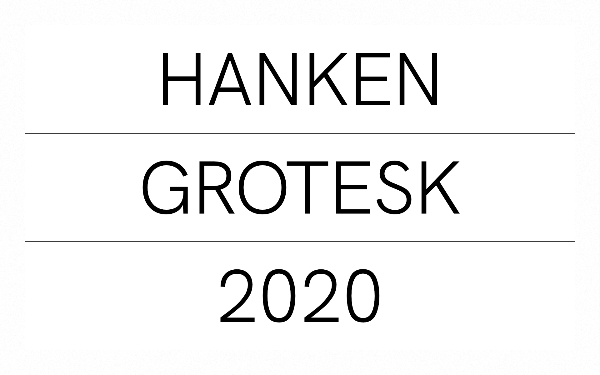
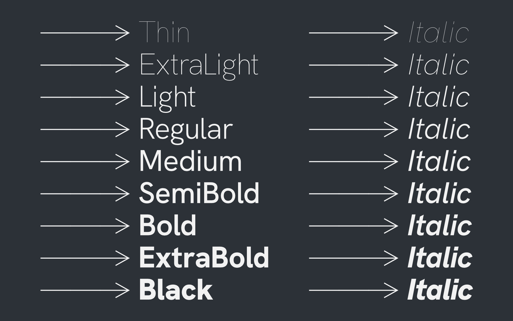

# Hanken Grotesk

This is a repository of Open Source files of the Hanken Grotesk typeface.

Hanken Grotesk is a sans serif typeface inspired by the classic grotesques. Geometry, metrics, punctuations and OpenType features have been updated to support a wide range of projects such as environmental signage, textface for books and magazines, Interface, Websites and Mobile Applications.

The Hanken Grotesk project is led by Alfredo Marco Pradil. To contribute, see https://github.com/marcologous/hanken-grotesk

Type Specimens:






## Building the Fonts

The font is built using fontmake and gftools post processing script. Tools are all python based, so it must be previously installed.

To install all the Python tools into a virtualenv, do the following:

From terminal:

```

cd your/local/project/directory

#once in the project folder create a virtual environment.
This step has to be done just once, the first time

python3 -m venv venv

#activate the virtual environment.
Do this every time you work on the project

source venv/bin/activate

#install the required dependencies
This step has to be done only once after creating a new virtual environment

pip install -r requirements.txt

```

Then run the this command:

```
cd sources
gftools builder config.yml
```
