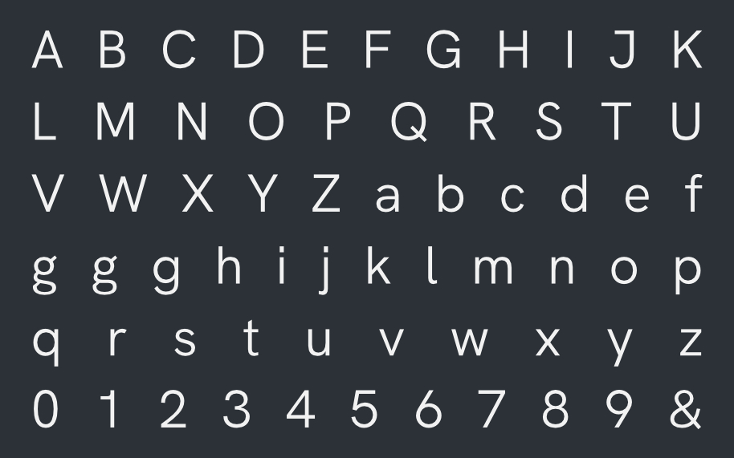

# Hanken Grotesk
This is a repository of Open Source files of the Hanken Grotesk typeface.

Hanken Sans is based on Hanken Design Co.'s HK Grotesk. HK Grotesk™ is a sans serif typeface inspired by the classic grotesques. Geometry, metrics, punctuations and OpenType features have been updated to support a wide range of projects such as environmental signage, textface for books and magazines, Interface, Websites and Mobile Applications.

The Hanken Grotesk project is led by Alfredo Marco Pradil of Hanken Design Co. — a design foundry based in the Philippines. To contribute, see https://github.com/marcologous/hanken-grotesk

Type Specimens:

